# DAY 12 – Введение в анализ данных
## Pandas, SQL, визуализация данных
В этом проекте вы будете заниматься визуализацией данных с использованием библиотек Matplotlib, Seaborn и Plotly. А также продолжать работать с Pandas и использовать SQL.

## Оглавление

1. [Глава I](#глава-i) \
    1.1. [Преамбула](#преамбула)
2. [Глава II](#глава-ii) \
    2.1. [Общая инструкция](#общая-инструкция)
3. [Глава III](#глава-iii) \
    3.1. [Цели](#цели)
4. [Глава IV](#глава-iv) \
    4.1. [Задание](#задание)
5. [Глава V](#глава-v) \
    5.1. [Сдача работы и проверка](#сдача-работы-и-проверка)

## Глава I
### Преамбула

Визуализация данных используется в двух случаях: во-первых, для того, чтобы представить результаты вашей работы кому-либо (работодателю, коллегам, клиентам и т. д.); во-вторых, для того, чтобы лучше разобраться в имеющейся у вас информации. Вот наглядный пример, который показывает как работает визуализация данных.

Попробуйте представить в уме или лучше возьмите в руки лист бумаги и постройте график распределения двух переменных со следующими характеристиками.

| Характеристика | Значение |
| ------ | ------ |
| Среднее значение x | 9 |
| Дисперсия x | 11 |
| Среднее значение y | 7,50 |
| Дисперсия y | 4,125 |
| Корреляция между х и у | 0,816 |
| График линейной регрессии | у = 3,00 + 0,5x |
| Коэффициент детерминации | 0,67 |

Вы думаете, что существует только один вариант расстановки точек? Нет, таких вариантов несколько. Они называются [квартетом Энскомба](https://ru.wikipedia.org/wiki/%D0%9A%D0%B2%D0%B0%D1%80%D1%82%D0%B5%D1%82_%D0%AD%D0%BD%D1%81%D0%BA%D0%BE%D0%BC%D0%B1%D0%B0).

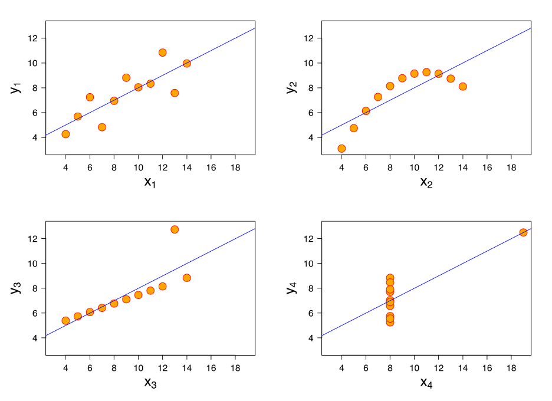

Все приведенные выше графики имеют одинаковые характеристики. Не верится, правда?

Отсюда вывод, что если вы посмотрите только на характеристики, у вас может сложиться неправильное впечатление. Поэтому используйте графики и визуализацию, чтобы лучше разобраться в данных.

## Глава II
### Общая инструкция

Методология Школы 21 может быть не похожа на тот образовательный опыт, который с вами случался ранее. Её отличает высокий уровень автономии: у вас есть задача, вы должны её выполнить. По большей части вам нужно будет самим добывать знания для её решения. Второй важный момент — это peer-to-peer обучение. В образовательном процессе нет преподавателей и экспертов, перед которыми вы защищаете свой результат. Вы это делаете перед таким же учащимися, как и вы сами. У них есть чек-лист, который поможет им качественно выполнить приемку вашей работы.

Роль Школы 21 заключается в том, чтобы обеспечить через последовательность заданий и оптимальный уровень поддержки такую траекторию обучения, при которой вы не только освоите hard skills, но и научитесь самообучаться.

* Не доверяйте слухам и предположениям о том, как должно быть оформлено ваше решение. Этот документ является единственным источником, к которому стоит обращаться по большинству вопросов;
* ваше решение будет оцениваться другими учащимися;
* подлежат оцениванию только те файлы, которые вы выложили в GIT (ветка develop, папка src);
* в вашей папке не должно быть лишних файлов — только те, что были указаны в задании;
* не забывайте, что у вас есть доступ к интернету и поисковым системам;
* обсуждение заданий можно вести и в Slack;
* будьте внимательны к примерам, указанным в этом документе — они могут иметь важные детали, которые не были оговорены другим способом;
* и да пребудет с вами Сила!

## Глава III
### Цели

У этого проекта две цели. Первая состоит в том, чтобы вы продолжили закреплять навыки работы с Pandas и SQL. Навык закрепляется через повторение и частое обращение к определенным командам и паттернам. И вторая цель – дать навыки визуализации данных, показать, какие существуют виды графиков и для чего они нужны, какие выводы из них можно сделать.

## Глава IV
### Обязательная часть

В этом проекте снова создайте для каждого упражнения отдельную папку: `task1`, `task2`, `task3` и т.д. Ведите работу в них.

В этом проекте вы будете работать с теми же датасетами, что использовались на прошлом проекте.
Мы попытаемся еще лучше разобраться в данных, которые описывают поведение учащихся одной компании из сферы образования. Вы снова обратитесь к библиотеке Pandas и языку программирования SQL, чтобы улучшить свои навыки программирования, а также будете использовать различные библиотеки для визуализации данных на языке программирования Python: `Matplotlib`, `Seaborn` и `Plotly`.

#### Task 1: Линейная диаграмма

Как обычно, давайте начнем с простой задачи. Если вы еще ни разу не рисовали графики в Python, пришло время заняться этим. Помните, как мы анализировали страницу новостной ленты? Задумывались ли вы о том, как часто посещали эту страницу пользователи?

1. Установите соединение с [базой данных](datasets/checking-logs.sqlite) (как и в прошлом проекте).
2. Выполните запрос, который достает `datetime` из таблицы `pageviews`; выбирайте только пользователей, а не администраторов.
3. Используя библиотеку Pandas, создайте новый датафрейм, в котором посещения страницы будут подсчитаны и сгруппированы по дате.
4. Используя метод `.plot()` библиотеки Pandas, создайте график.
    - Размер шрифта — 8.
    - `figsize` — 15,8.
    - Название графика — «Число просмотров в день».
    - Обратите внимание на поворот надписей на оси x на графике ниже.
5. Закройте соединение с базой данных.

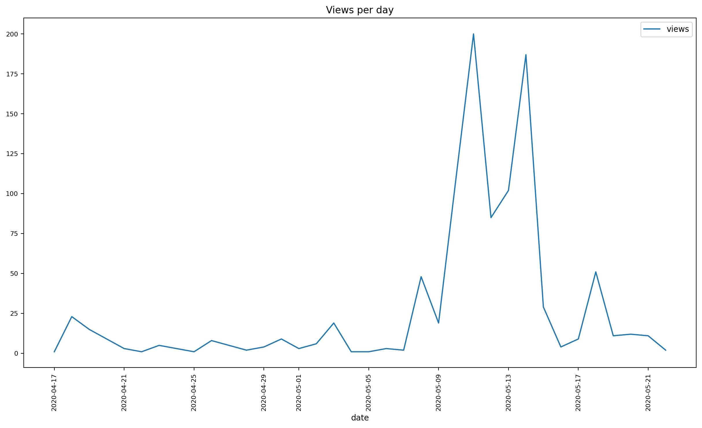

#### Task 2: Линейная диаграмма со стилями
Класс! Помните, что у нас есть данные о коммитах? Было бы полезно нарисовать обе метрики времени на одном графике. Что, если мы увидим закономерности?

Вам нужно создать точно такой же график, как показано ниже (и по значениям, и по стилю):

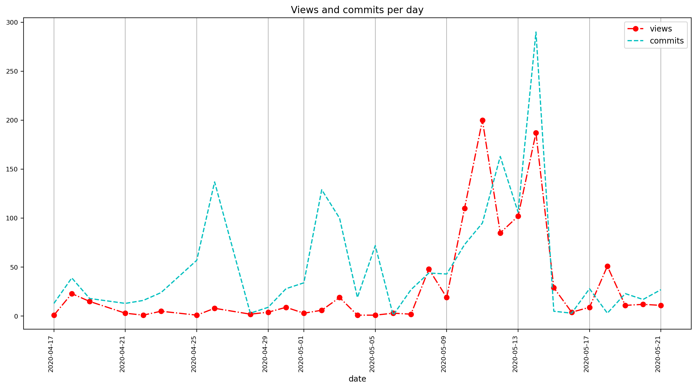

1. Анализируйте только пользователей, а не администраторов.
2. Используйте фильтр `status = 'ready'` для коммитов.
3. Анализируйте только те даты, когда были зафиксированы и просмотры, и коммиты.
4. Размер шрифта — 8.
5. `figsize` — 15,8.
6. В конце Jupyter Notebook создайте markdown-ячейку и вставьте вопрос: «Сколько раз количество просмотров превышало 150?». В ячейке ниже добавьте: «Ответ:___». Поместите в текст конкретное число вместо подчеркивания.

#### Task 3: Столбиковая диаграмма (barchart)
У нас есть еще один вопрос, на который необходимо ответить: когда пользователи обычно выполняют лабораторные задания (делают коммиты): ночью, утром, днем или вечером? И как их поведение менялось с течением времени?

Выполните необходимые шаги по созданию следующего графика:

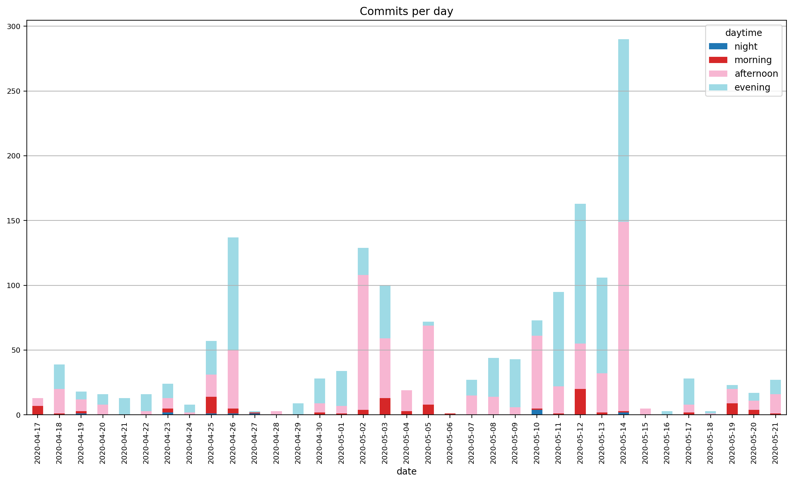

1. Анализируйте только пользователей, а не администраторов.
2. Используйте фильтр `status = 'ready'` для коммитов.
3. Размеры шрифта и `figsize` такие же, как и раньше.
4. Ночь — с 0:00:00 до 03:59:59, утро — с 04:00:00 до 09:59:59, день — с 10:00:00 до 16:59:59, вечер — с 17:00:00 до 23:59:59.
5. Выберите цветовую палитру по своему вкусу, не обязательно использовать те же самые цвета, что на графике выше.
6. В конце Jupyter Notebook создайте markdown-ячейки и вставьте в них следующие вопросы.
    - «Когда пользователи обычно выполняют лабораторные задания: ночью, утром, днем или вечером?». Ответ — два наиболее распространенных периода времени.
    - «В какой день имеется наибольшее количество коммитов и одновременно с этим количество коммитов вечером выше, чем днем?» Ответ — дата этого дня.

#### Task 4: Столбиковые диаграммы
Что, если среднее количество коммитов отличается для рабочих дней и выходных?

Выполните необходимые шаги по созданию следующего графика:
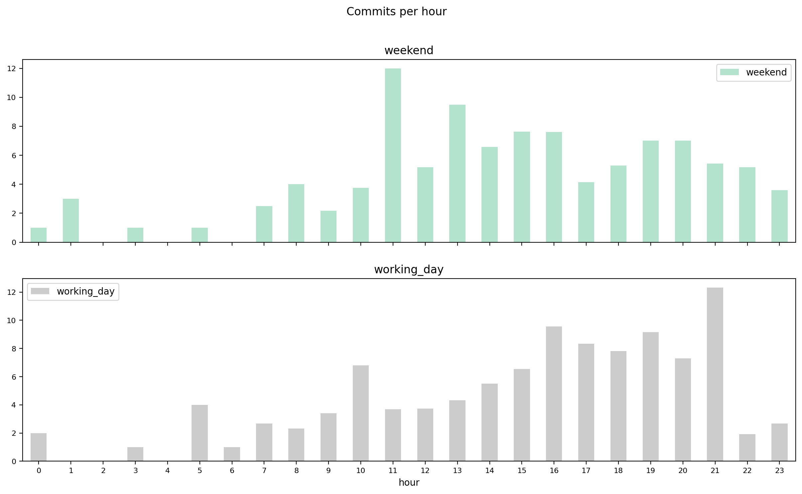

1. Анализируйте только пользователей, а не администраторов.
2. Используйте фильтр `status = 'ready'` для коммитов.
3. Размеры шрифта и `figsize` такие же, как и раньше.
4. Для каждого часа подсчитайте среднее количество коммитов в рабочие дни и в выходные (если в течение часа в одну из дат не было коммитов, не используйте его для расчета среднего значения). Используйте эти значения для расчета средних в категории "рабочие дни" и в категории "выходные" и дальнешего построения графика, например: понедельник, 17–18: 5 коммитов; вторник, 17–18: 6 коммитов; среда, 17–18: 7 коммитов.
5. Выберите цветовую палитру по своему вкусу, не обязательно использовать те же самые цвета, что на графике выше.
6. В конце Jupyter Notebook создайте markdown-ячейку и вставьте вопрос:
    - «Отличается ли динамика в рабочие и выходные дни?». В качестве ответа добавьте значения часа, когда количество коммитов является наибольшим в рабочие дни, и часа, когда количество коммитов является наибольшим в выходные дни.

#### Task 5: Гистограмма
В предыдущем задании вы визуализировали распределение, вручную группируя значения с помощью библиотеки Pandas. Было бы полезно как-то автоматизировать эту задачу? Нет ничего проще.

Но для этого нам нужно использовать другой тип визуализации данных — гистограмму. На этот раз вместо средних значений мы будем использовать абсолютные значения числа коммитов и сравним их в рабочие и выходные дни.

Выполните необходимые шаги по созданию следующего графика:

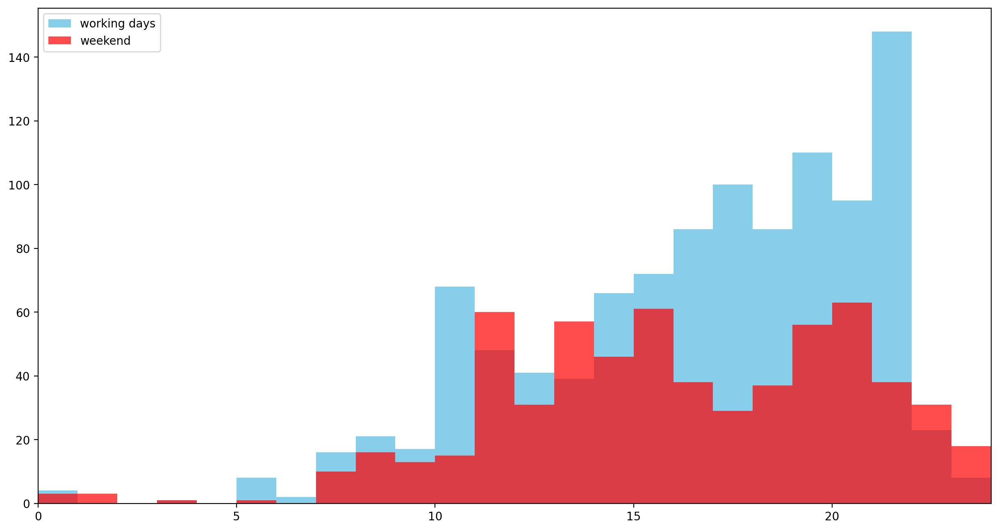

1. Анализируйте только пользователей, а не администраторов.
2. Используйте фильтр `status = 'ready'` для коммитов.
3. Создайте два списка значений (для рабочих дней и для выходных) в качестве входных данных для гистограммы.
4. Размер `figsize` остается прежним; размер шрифта и цветовую палитру выбирайте по своему вкусу.
5. Используйте уровень прозрачности `0,7` для переднего слоя гистограммы.
6. В конце Jupyter Notebook создайте markdown-ячейку и вставьте вопрос: «Существуют ли часы, когда общее количество коммитов было выше в выходные дни, чем в рабочие?». В своем ответе приведите примеры с 4 наибольшими значениями.

#### Task 6: Ящик с усами
Помните, как мы пытались выяснить, влияет ли посещение ленты новостей на поведение пользователей из тестовой и контрольной групп? В прошлый раз мы просто рассчитывали средние значения. Но знаем ли мы о дисперсиях? Что, если они тоже изменились? Что, если возникли аномальные значения?
Чтобы ответить на эти вопросы, нужно построить "ящик с усами" или boxplot.

Выполните необходимые шаги по созданию следующего графика:

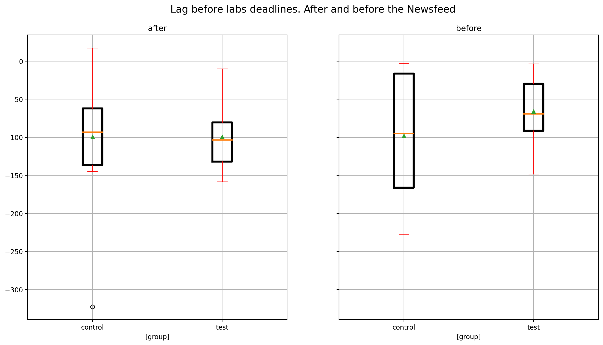

1. Используйте данные из [этого файла](datasets/ab-test.csv), считайте их в датафрейм и внесите любые изменения, которые, по вашему мнению, помогут решить задачу.
2. Размер `figsize` остается прежним, размер шрифта можно выбрать по своему вкусу.
3. Цветовая палитра должна быть такой же, как в примере.
4. Размер шрифта заголовка — 15.
5. Ширина линий ящиков — 3, ширина линий медианы — 2.
6. В конце Jupyter Notebook создайте markdown-ячейку и вставьте вопрос: «Каким было значение IQR контрольной группы до посещения новостной ленты?». В своем ответе укажите приблизительное значение, которое можно получить, просто посмотрев на график, и округлите его до ближайшего целого, кратного 10.

#### Task 7: Матрица рассеяния (scatter matrix)
Помните, как мы пытались выяснить, есть ли корреляция между количеством посещений ленты новостей и средним значением дельты (разницы между датой первого коммита и сроком сдачи лабораторного задания)? Проблема в том, что коэффициент корреляции показывает наличие _линейной_ взаимосвязи между двумя переменными. Но что, если она не линейная? Как мы можем об этом узнать? Правильно — с помощью графиков!

Выполните необходимые шаги по созданию следующего графика:

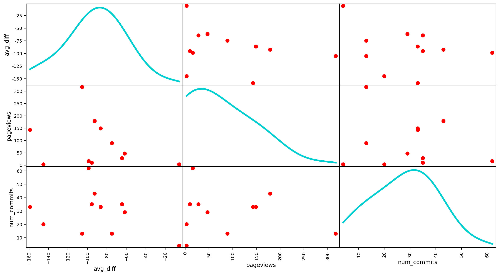

1. Создайте датафрейм, в котором для каждого пользователя тестовой группы имеется среднее значение дельты, количество просмотров страниц и количество коммитов.
2. Не учитывайте лабораторное задание `project1` при расчете среднего значения дельты и количества коммитов.
3. Возьмите количество коммитов из таблицы `checker`.
4. Используйте фильтр `status = 'ready'` для коммитов.
5. Размер `figsize` остается прежним; размер шрифта и цветовую палитру можно выбрать по своему усмотрению.
6. Размер точек — 200.
7. Ширина линий на графиках, расположенных по главной диагонали (`kde`) — 3.
8. В конце Jupyter Notebook создайте markdown-ячейку и вставьте в нее следующие вопросы.
    - «Верно ли, что если у пользователя меньше просмотров страницы, то он, скорее всего, имеет меньшее число коммитов?». Ответ: да или нет.
    - «Верно ли, что если у пользователя меньше просмотров страницы, то, скорее всего, у него будет небольшое среднее значение дельты (разница между датой первого коммита и сроком сдачи лабораторного задания)?». Ответ: да или нет.
    - «Верно ли, что существует много пользователей с небольшим количеством коммитов и мало пользователей с большим количеством коммитов?». Ответ: да или нет.
    - «Верно ли, что существует много пользователей с небольшим средним значением дельты и мало пользователей с большим средним значением дельты?». Ответ: да или нет.

### Бонусная часть
#### Task 8: Тепловая карта (heatmap)
Несколько упражнений назад мы хотели выявить закономерности в поведении пользователей во время рабочих и выходных дней. В этом упражнении давайте выясним, существуют ли закономерности в поведении пользователей в разные дни недели и часы.

1. Анализируйте только пользователей, а не администраторов.
2. Используйте фильтр `status = 'ready'` для коммитов.
3. Разрешается выбрать цветовую палитру по своему вкусу для обоих графиков, которые вы построите в этом упражнении.
4. Используйте таблицу `checker` для вашего запроса.
5. Используйте абсолютные исходные, а не средние значения числа коммитов.
6. Отсортируйте датафреймы по общему числу коммитов, сделанных пользователем.
7. В конце Jupyter Notebook создайте markdown-ячейку и вставьте вопросы (ответьте на них, глядя только на графики):
    - «У какого пользователя больше всего коммитов во вторник?». Ответ: `user_*`.
    - «У какого пользователя больше всего коммитов в четверг?». Ответ: `user_*`.
    - «В какой будний день пользователи не любят делать много коммитов?». Ответ (в качестве примера): понедельник.
    - «Какой пользователь в каком часу сделал наибольшее количество коммитов?». Ответ (в качестве примера): user_1, 15.
8. Выполните необходимые шаги по созданию следующих двух графиков:

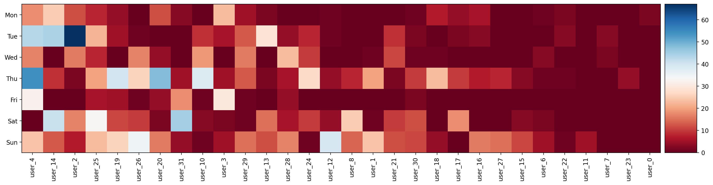

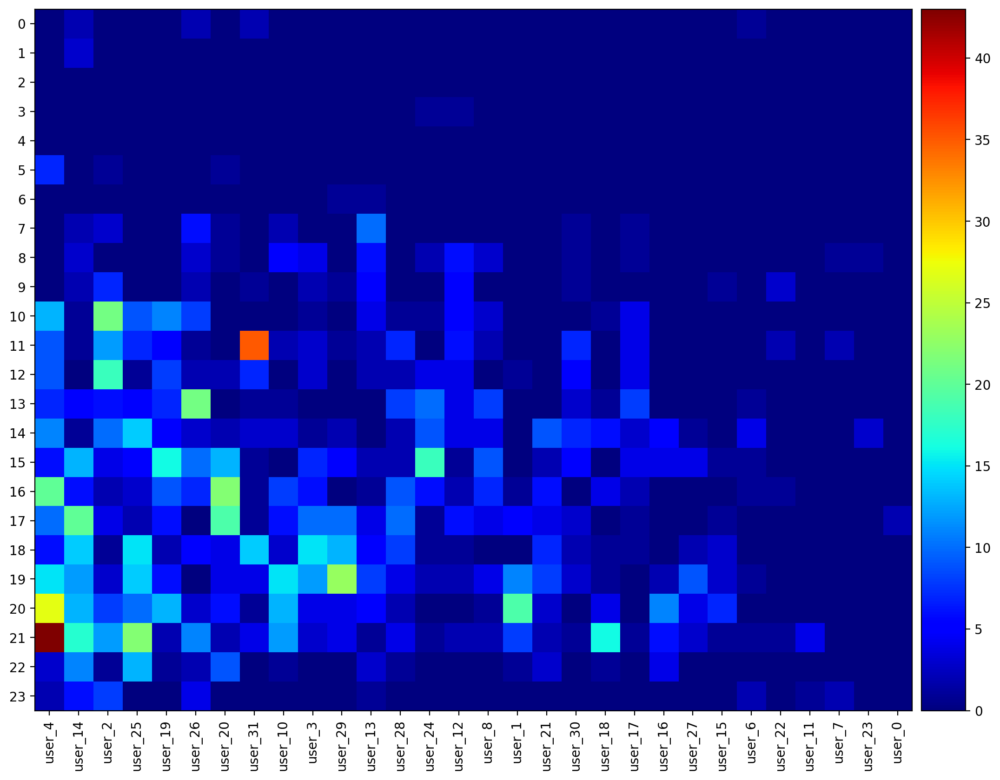

#### Task 9: Библиотека Seaborn
Итак, в предыдущих упражнениях мы иногда не брали в расчет лабораторное задание `project1`. В рамках него был соревновательный проект. Оно имело более длительные сроки сдачи и гораздо больше коммитов, чем обычное лабораторное задание. Давайте проанализируем динамику коммитов в этом проекте на одного пользователя. На этот раз мы будем использовать другую библиотеку для визуализации данных в Python — Seaborn. Эта библиотека упрощает создание стильных графиков.

Выполните необходимые шаги по созданию следующего графика:

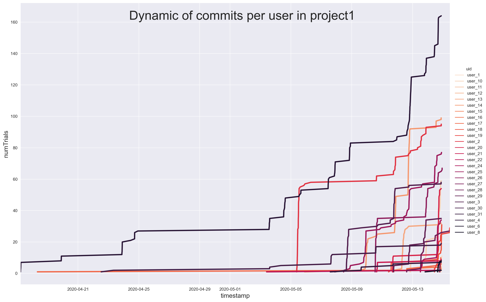

1. Анализируйте только пользователей, а не администраторов.
2. Учитывайте только записи из таблицы `checker` со статусом `ready`.
3. Выбирайте цветовую палитру по своему усмотрению.
4. Ширина линии — 3.
5. Фон графика — серый.
6. Высота — 10, а ширина — 1,5х по отношению к высоте.
7. Размер шрифта заголовка — 30.
8. Размер шрифта меток осей — 15.
9. В конце Jupyter Notebook создайте ячейку с разметкой и вставьте вопросы (ответьте на них, глядя только на графики):
    - «Какой пользователь имел самое большое количество коммитов на протяжении почти всего времени?». Ответ: `user_*`.
    - «Какой пользователь был лидером по количеству коммитов, но в течение очень ограниченного периода времени?». Ответ: `user_*`.

#### Task 10: Библиотека Plotly
Matplotlib и Seaborn являются действительно многофункциональными библиотеками, которые отлично подходят для решения большинства задач по визуализации данных. Но они не поддерживают функции создания интерактивных диаграмм и анимаций. Для решения такого рода задач применяется библиотека Plotly. В этом упражнении вам нужно будет построить почти такой же график, как и в предыдущем упражнении, но в виде анимации.

Выполните необходимые шаги по созданию следующего графика:

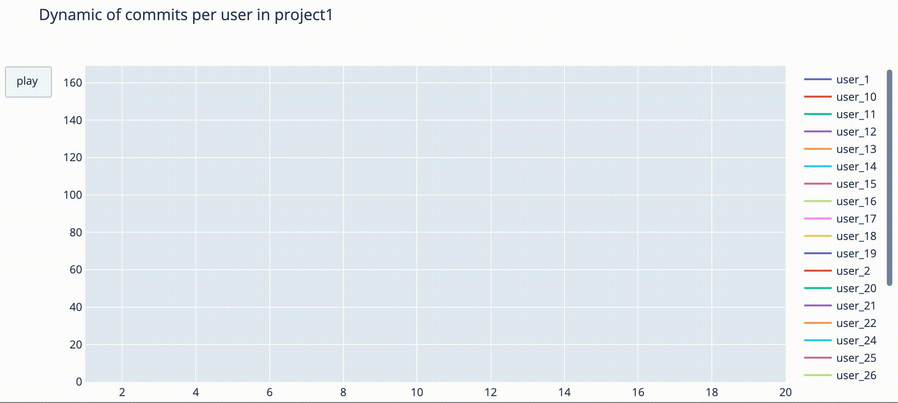

Это сложная задача. Трудно найти хорошие и понятные туториалы, поэтому воспользуйтесь [этой ссылкой](https://github.com/datageekrj/YouTubeChannelHostingFiles/blob/master/lineRace.py) в качестве справочного материала.

## Глава V
### Сдача работы и проверка

1. Работу над каждым заданием выполняйте в отдельном ноутбуке, поскольку объем кода и данных может быть большим. Для вас и проверяющих это будет удобнее.
2. Для каждой основной подзадачи в списке любого упражнения (пронумерованы) файл ipynb должен иметь заголовок уровня h2, чтобы другие участники курса могли без проблем разобраться в вашем программном коде.
3. Под каждое упражнение должна быть отдельная папка, в которую входит ноутбук и сохраненные по итогам работы файлы, если таковые были указаны.
4. Загрузите все эти папки в GIT-репозиторий этого проекта для проверки.

Пожалуйста, оставьте обратную связь по проекту в [форме обратной связи.](https://forms.gle/AKLQdmFtwhaZHHQr9)
